# 归山村落 · 运营协作小程序

> 一个基于微信小程序云开发的内部运营协作系统，用于多人共同运营场景下的任务、库存、采购、记账、报销、权限与工作记录管理。

项目来自真实运营需求，逐步形成了由 **任务系统、仓库与采购、金库与报销、人员与权限、工作记录、长期借款台账、AI 辅助** 组成的一体化小程序。

## 界面预览

<table>
  <tr>
    <td align="center">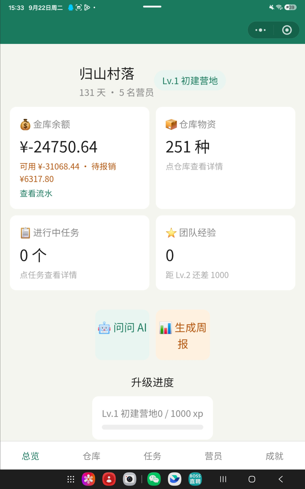<br>运营总览</td>
    <td align="center">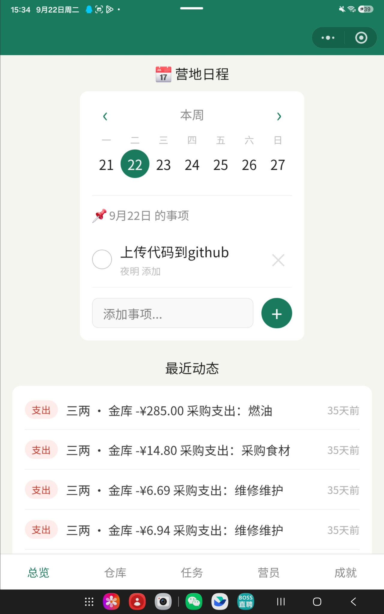<br>营地日程</td>
    <td align="center">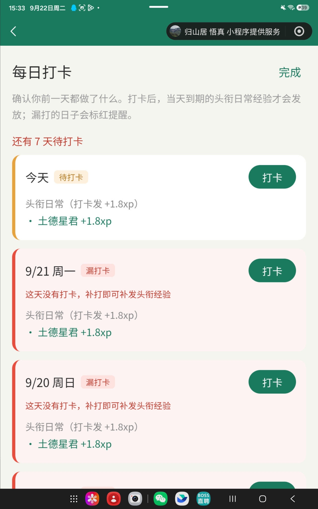<br>每日打卡</td>
  </tr>
  <tr>
    <td align="center">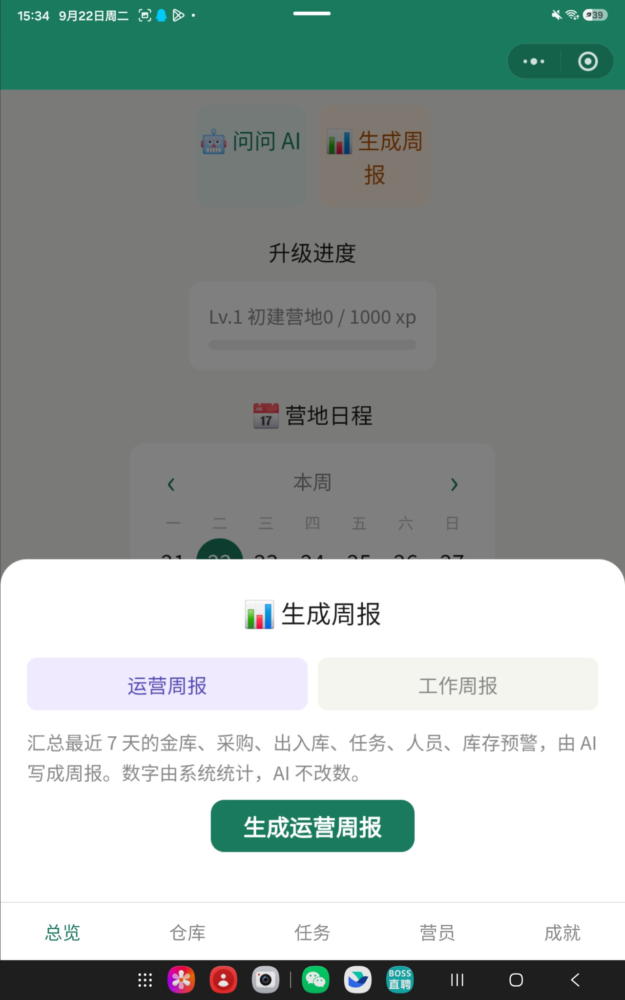<br>运营周报</td>
    <td align="center">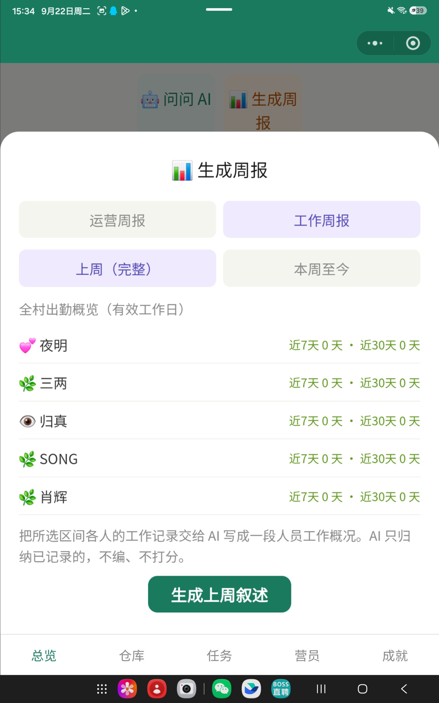<br>工作周报</td>
    <td align="center">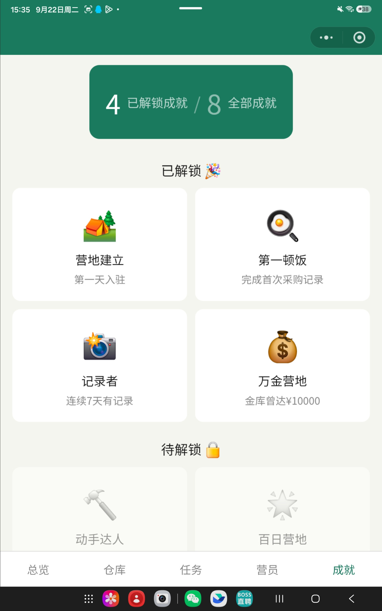<br>成就系统</td>
  </tr>
  <tr>
    <td align="center">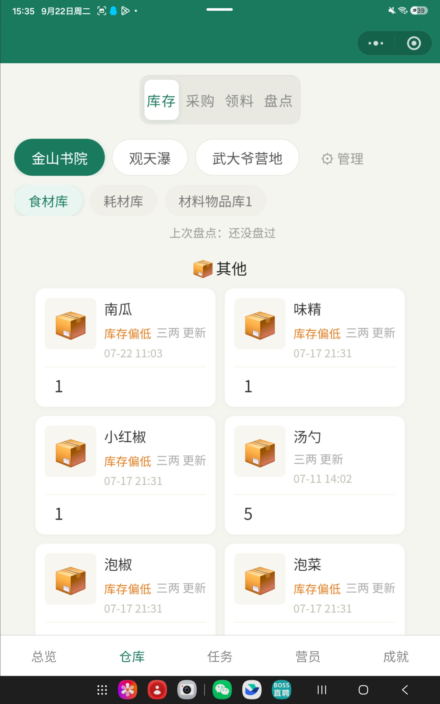<br>库存管理</td>
    <td align="center">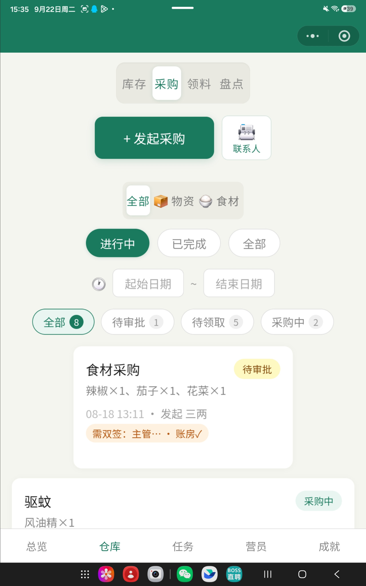<br>采购流程</td>
    <td align="center">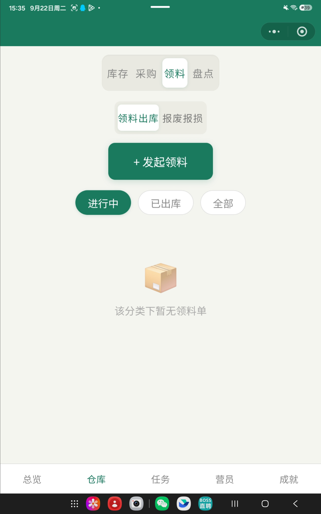<br>领料流程</td>
  </tr>
  <tr>
    <td align="center">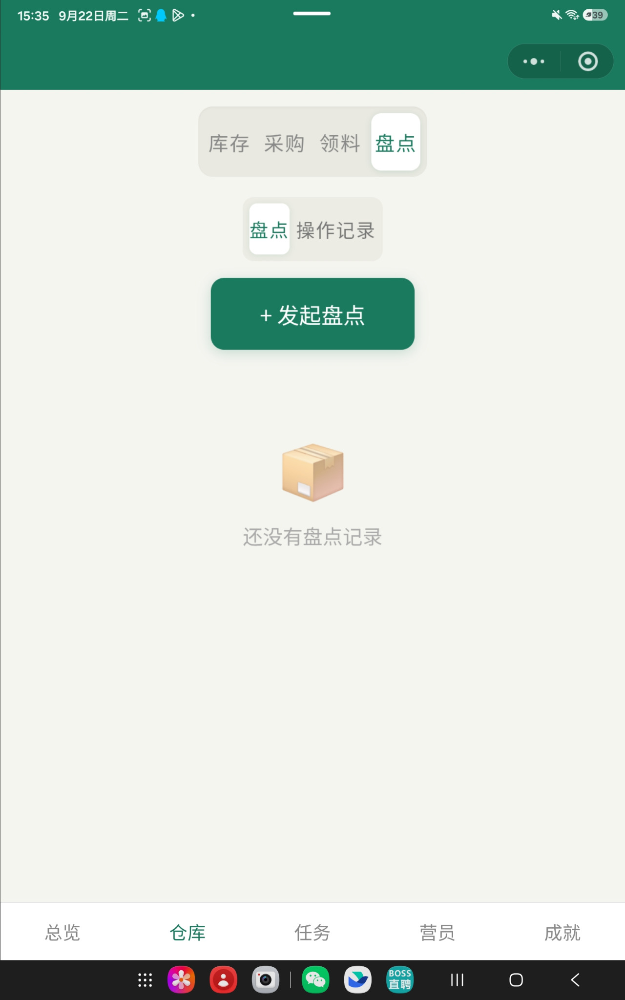<br>库存盘点</td>
    <td align="center">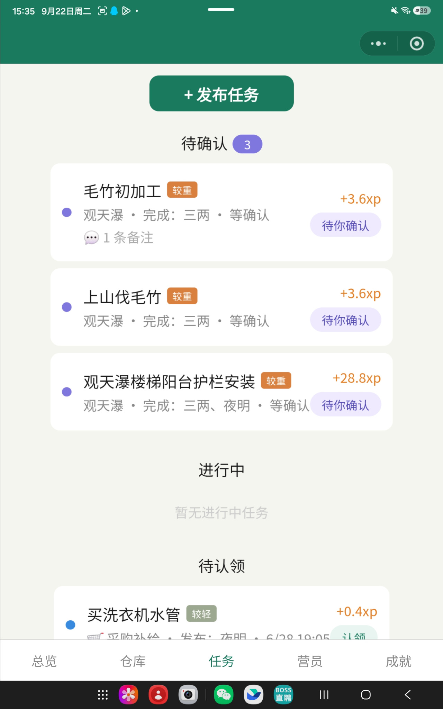<br>任务协作</td>
    <td align="center">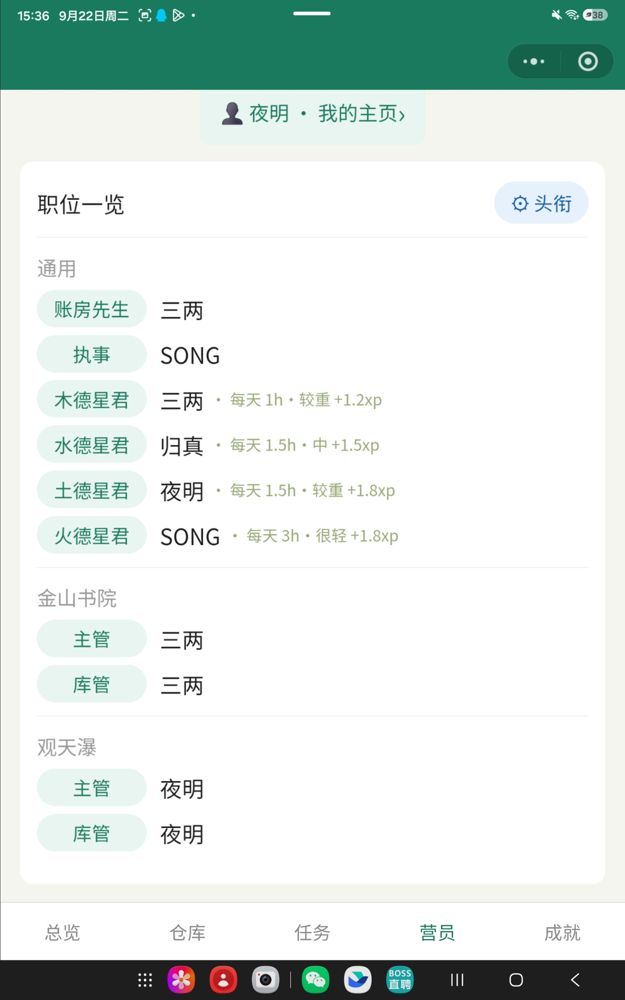<br>营员与职位</td>
  </tr>
</table>

以上 12 张截图来自小程序实际运行页面，用于展示总览、仓库、任务、营员与成就等主要模块。截图中的姓名、余额、采购与任务内容属于当时的页面记录，不包含对应云数据库或可登录凭证。

## 核心功能

### 任务与工作记录

- 任务发布、多人认领、交付清单、完成确认与打回重做
- `open → doing → submitted → closed` 状态流转，并支持 `onhold` 搁置
- 工时 × 强度系数计算 XP，认领后的修改保留原因和记录
- 每日打卡、有效工作日、个人工作记录与自动日报
- 定时任务自动处理超时确认与工作摘要

### 金库、费用与报销

- 收入 / 支出流水、汇总统计与 Excel 导出
- 金库余额、可用资金、待报销金额分开核算
- 采购垫款与自由垫付统一查看、逐笔或批量结算
- 短期垫付款经全体主管审批后可转为长期借款
- 独立借款台账、还款记录与费用去重，避免转借款或还款被重复计为新费用

### 仓库与采购

- 按“地点 → 分库”组织库存
- 物品实拍图、库存数量、低库存提示、盘点与操作记录
- 即时消耗、领用免审、领用需审批三种出库方式
- 采购申请 → 审批 → 认领 → 报账 → 核验 → 入库 → 记账完整流程
- 常用供应商 / 联系人通讯录

### 多角色与分地点权限

- **主管**：按地点负责审批与运营流程
- **库管**：按地点负责库存、入库、领料与盘点
- **账房先生**：全局负责流水、报销、出资和借款还款
- **执事**：负责人员加入 / 退出流程
- **普通营员**：完成任务、采购、领料和垫付等日常操作

主管与库管权限同时受角色和 `siteId` 约束，避免跨地点误操作。

### 人员与协作治理

- 新成员申请与身份绑定
- 角色任命、撤销与分地点管理
- 头衔、职责、排期与工作清单
- 人员加入 / 退出表决
- 出资台账、历史记录与关键操作留痕

### AI 辅助

- 根据任务描述估算工时、强度并生成交付清单
- 通过文字、图片、Excel、Word 整理入库清单
- 基于系统数据回答运营问题并整理日报 / 周报
- 根据岗位职责生成工作清单

金额、XP、出勤等确定性数据由程序计算；AI 负责辅助整理和表达，不改写业务数字。

## 技术栈

| 分类 | 技术 |
| --- | --- |
| 客户端 | 微信小程序原生 JavaScript / WXML / WXSS |
| 后端 | 微信云开发 Cloud Functions |
| 数据库 | 微信云数据库 |
| 文件 | 微信云存储 |
| AI | DeepSeek API、火山方舟 / 豆包 API |
| 文档解析 | `xlsx`、`mammoth` |
| Excel 导出 | `exceljs` |
| 云函数运行时 | Node.js、`wx-server-sdk` |

## 系统架构

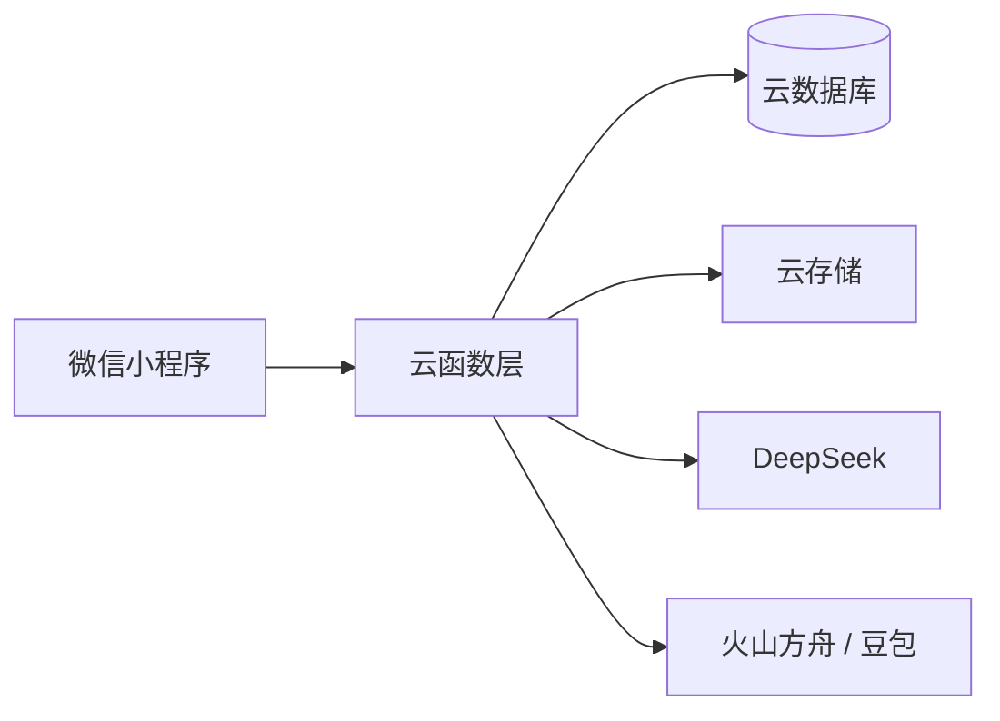

主要云函数：

- `taskManager`：任务、打卡与日报
- `campManager`：金库、报销、费用台账与报表
- `warehouseManager`：库存、库房树与盘点
- `purchaseManager`：采购状态机
- `memberManager`：成员、角色、表决、出资与借款
- `requisitionManager`：领料流程
- `scrapManager`：报废报损
- `aiSuggestXp` / `aiStockIn`：AI 辅助能力

## 核心设计

### 业务状态机

任务、采购和报销使用明确状态流转，不依靠页面显示状态判断业务结果。例如采购流程：

```text
pending → open → buying → checking → verified → done
```

物品入库与财务记账使用两条状态线，实物流完成后仍可处于待记账状态。

### 确定性计算与 AI 分离

金额、XP、出勤天数等数据全部由程序计算；AI 只接收已计算数据并负责整理语言或生成建议，降低大模型修改业务数字的风险。

### 权限与地点绑定

主管和库管权限不仅由角色决定，还与 `siteId` 绑定。权限判断在云函数端执行，客户端主要负责界面展示。

### 留痕与可追溯

任务工时修改、采购审批、库存变更、盘点、报销、角色任命、借款形成与还款等关键动作均保留记录。

## 项目结构

```text
.
├── cloudfunctions/              # 云函数
│   ├── aiStockIn/
│   ├── aiSuggestXp/
│   ├── campManager/
│   ├── memberManager/
│   ├── purchaseManager/
│   ├── requisitionManager/
│   ├── scrapManager/
│   ├── taskManager/
│   └── warehouseManager/
├── miniprogram/
│   ├── pages/                   # 总览、仓库、任务、成员、个人与打卡页面
│   ├── config.example.js        # 云环境 ID 配置模板
│   └── app.js
├── docs/screenshots/            # 项目截图
├── .env.example                 # 本地脚本与云函数环境变量字段示例
├── .gitignore
└── project.config.json          # 使用公开占位 AppID
```

## 本地运行

### 1. 获取代码

克隆仓库后，用微信开发者工具导入项目根目录。项目不绑定任何固定的电脑路径，放在任意目录均可。

### 2. 配置小程序 AppID

公开仓库中的 `project.config.json` 使用：

```json
"appid": "touristappid"
```

它只是公开占位值，不是生产 AppID。要使用云开发和完整调试能力，请在微信开发者工具中换成自己的小程序 AppID。

> AppID 是微信开发者工具读取的项目配置，不能由小程序运行时的 `.env` 自动注入。真实 AppID 虽不是 AppSecret，但本仓库仍不保存原项目标识。

### 3. 配置云环境 ID

复制本地配置模板：

```bash
cp miniprogram/config.example.js miniprogram/config.local.js
```

Windows PowerShell：

```powershell
Copy-Item miniprogram/config.example.js miniprogram/config.local.js
```

然后修改 `miniprogram/config.local.js`：

```js
module.exports = {
  cloudEnvId: '你的云环境 ID'
}
```

`config.local.js` 已加入 `.gitignore`。仓库只提交字段模板，不提交真实环境 ID。

> 微信小程序前端不会自动读取 Node.js 风格的 `.env`，因此云环境 ID 使用本地 JS 配置文件；这是有意区分，不是重复配置。

### 4. 创建云环境并部署云函数

在微信开发者工具中创建自己的云开发环境，然后依次部署 `cloudfunctions/` 下需要使用的云函数。含 npm 依赖的函数建议选择“上传并部署：云端安装依赖”。

项目也保留了可选脚本 `uploadCloudFunction.sh`。如使用该脚本：

1. 复制 `.env.example` 为 `.env`
2. 填写 `WECHAT_CLI_PATH` 和 `WECHAT_CLOUD_ENV_ID`
3. 可选填写 `WECHAT_PROJECT_PATH`；留空时默认使用仓库根目录
4. 运行 `./uploadCloudFunction.sh 函数名`

本机绝对路径只允许出现在被忽略的 `.env` 中，源码与文档不依赖作者电脑路径。

### 5. 配置 AI 云函数环境变量

在微信云开发控制台为对应云函数设置运行时环境变量：

| 云函数 | 环境变量 | 用途 |
| --- | --- | --- |
| `aiSuggestXp` | `DEEPSEEK_API_KEY` | 任务工时、强度与交付清单辅助 |
| `aiStockIn` | `ARK_API_KEY` | 火山方舟接口认证 |
| `aiStockIn` | `ARK_MODEL` | 火山方舟模型 / Endpoint ID |

这些值必须配置在云函数运行环境中，不能写入小程序前端。`.env.example` 中的同名字段仅用于说明配置清单，不会自动上传密钥。

### 6. 初始化业务角色

首次使用时至少配置主管、库管和账房先生；主管与库管需要绑定对应地点。之后才能完整走通审批、库存和财务流程。

## 配置文件说明

| 文件 / 配置 | 是否提交 | 作用 |
| --- | --- | --- |
| `project.config.json` | 是 | 微信项目公共配置；仅保留占位 AppID |
| `project.private.config.json` | 否 | 微信开发者工具生成的个人配置 |
| `miniprogram/config.example.js` | 是 | 云环境 ID 字段模板 |
| `miniprogram/config.local.js` | 否 | 本机实际云环境 ID |
| `.env.example` | 是 | 本地脚本及云函数变量名称示例 |
| `.env` | 否 | 本机 CLI 路径等本地值 |
| 云函数环境变量 | 否 | DeepSeek / 火山方舟真实密钥 |

## 公开仓库安全说明

本仓库不应包含：

- 生产 API Key、Token、AppSecret
- 原项目真实 AppID 与云环境 ID
- `project.private.config.json`
- 本机绝对路径
- `node_modules`
- 用户 OpenID、手机号、票据、财务凭证或生产数据库导出
- Android / iOS 签名私钥或密码文件

提交前可使用以下命令确认忽略规则：

```bash
git status --ignored
```

## 项目背景

相比单纯的 CRUD 示例，本项目更关注多人协作中的实际工程问题：

- 谁可以操作什么，以及权限是否受业务地点约束
- 一笔钱当前属于费用、待报销、采购垫款还是长期借款
- 实物流和资金流如何分别确认
- 多人审批如何避免重复处理和状态冲突
- 操作发生后如何追踪责任与历史
- AI 应参与哪些环节，又不应触碰哪些确定性数据

## 项目状态

项目仍在持续迭代。当前已补齐 12 张实际运行截图；后续计划包括完善分页与测试、统一历史命名、继续拆分体量较大的云函数。

## License

本项目当前用于个人作品集与技术展示，暂未附加开源许可。未经许可，不代表允许复制、分发或用于商业项目。
